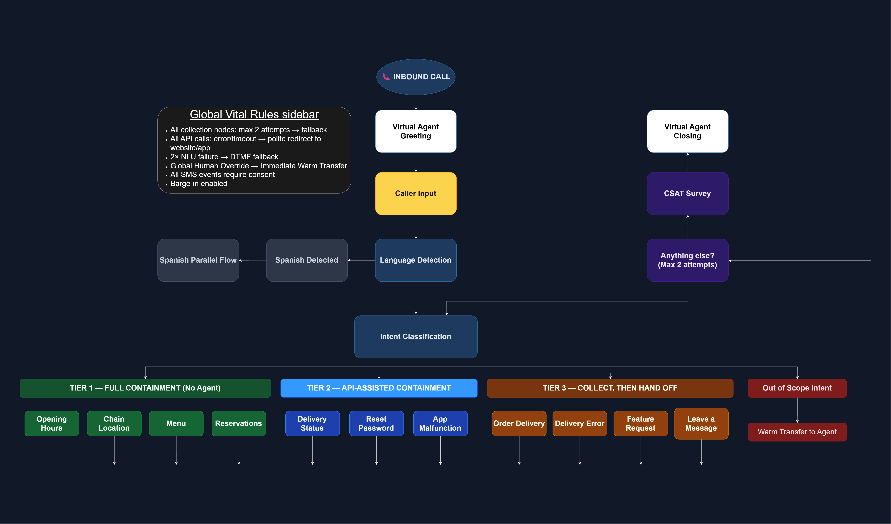

# Za Pizza Voice AI Agent: Architecture and Executive Deck (Vonage Take-Home)

**A 48-hour Solutions Engineering take-home for Vonage. Za Pizza is a fictional brand.**

---

## The Challenge

Modernize a legacy 150-agent DTMF IVR into a high-containment Voice AI experience using a fixed 11-intent schema — without degrading CSAT.

**Solution:** A 3-tier containment architecture with a modelled $3.4M net Year 1 value and a projected CSAT improvement to 4.4.  
**Outcome:** Reached the final round of the Vonage Solutions Engineering process.  
**Scope:** Full discovery, architecture, NLU training data, conversation flows, and ROI modeling.  
**Turnaround:** 48 hours.

---

## Architecture Overview

I grouped all 11 intents into a 3-tier framework based on how much human involvement each requires. This framing was a deliberate choice — it lets a client see immediately what percentage of their call volume can be fully deflected, partially contained, or enriched before reaching an agent.

> **Legend:** [View node type legend](./assets/Legend.drawio.png)

| Tier | Logic | Intents |
|------|-------|---------|
| **Tier 1 — Full Containment** | Resolved entirely by the VA, no agent needed | Opening Hours, Chain Location, Menu, Reservations |
| **Tier 2 — API-Assisted Containment** | Resolved via live API call, agent rarely needed | Delivery Status, Reset Password, App Malfunction |
| **Tier 3 — Collect, Then Hand Off** | VA collects full context, then warm transfers with an agent whisper or logs a CRM ticket | Order Delivery, Delivery Error, Feature Request, Leave a Message |

Global rules applied across all flows: max 2 collection attempts before fallback, 2× NLU failure triggers DTMF fallback, all API errors redirect politely to app or website, global human override routes to immediate warm transfer, barge-in enabled throughout.

---

## Financial Impact

*Projected 10-month cumulative savings — break-even at month 5.*

The ROI model uses Za Pizza's baseline of about 75,000 calls a month across 150 agents, at $5 per contact. By months 5-6 it projects agent-handled calls falling from 95% to 40% and cost per contact falling to $2, plus revenue recovered as fewer callers hang up. That recovers implementation costs within 5 months and gives a modelled $3.4M net value in Year 1.

---

## Growth Roadmap

*Post-launch expansion: personalization, proactive outreach, and autonomous error resolution.*

The roadmap has five post-launch extensions: personalisation and loyalty, proactive outreach, autonomous error resolution, live intelligence, and platform consolidation. Each builds on the same intent schema without requiring a redesign.

---

## Key Design Decisions

**One platform, not a permanent hybrid IVR.**
Running the legacy DTMF system alongside a new VA long term means two vendor contracts, two maintenance tracks, and a broken caller experience at the handoff seam. The roadmap ends by migrating the legacy DTMF system to Vonage, so everything runs on one platform.

**Native language detection over prompting.**
Asking callers to "press 1 for English" replicates the worst of DTMF. The design uses automatic language detection: the VA detects Spanish from the first utterance and routes to the parallel Spanish flow without the caller doing anything.

**Warm transfer with agent whisper, not cold transfer.**
For Tier 3 intents that need an agent (Order Delivery and Delivery Error), the VA collects complete context before handoff and passes it to the agent as a whisper. Feature Request and Leave a Message log a CRM ticket instead. The agent hears the caller's name, issue type, and relevant details before the call connects. Callers never repeat themselves — which is the single biggest driver of CSAT drop on escalated calls.

**Upsell node in Order Delivery.**
The brief was about cost reduction. But a VA that only deflects misses the revenue side. After order confirmation and before warm transfer, I added a lightweight upsell attempt triggered by a Menu KB query for relevant add-ons. One node, zero friction.

**Risk Mitigation — Allergy & Dietary Queries.**
Voice AI in a high-noise environment is a liability for health-sensitive data. I deliberately designed the VA to redirect allergy and dietary queries to the app and website, where content is managed, versioned, and legally defensible. If the VA answers it wrong, it's a health and legal issue — not a UX one.

---

## Deliverables

| File | Description |
|------|-------------|
| [Stakeholder Presentation Final.pdf](./deck/Stakeholder%20Presentation%20Final.pdf) | 8-slide executive presentation: business case, ROI model, architecture, growth roadmap |
| [Stakeholder Presentation Intents.pdf](./deck/Stakeholder%20Presentation%20Intents.pdf) | Individual slides for all 11 intents — flow summary, integrations, parameters per intent |
| [`nlu/training-utterances.md`](./nlu/training-utterances.md) | 132 NLU training utterances across all 11 intents (2 per intent supplied in the brief, 10 per intent written by me) |
| [`assets/Intents/`](./assets/Intents/) | Conversation flow diagrams for all 11 intents |
| [`assets/subflows/`](./assets/subflows/) | 7 sub-flow diagrams (Warm Transfer, CRM Ticket Creation, Contact Info Confirmation, After Hours, API Error, Out of Scope, Anything Else with CSAT survey) |

---

## About

I'm an AI Solutions Engineer focused on building high-ROI conversational systems. I work across the full stack from pre-sales scoping and solution design through to building and deploying production-grade AI systems.

[LinkedIn](https://www.linkedin.com/in/jai-goldberg142/) · [GitHub](https://github.com/Jacing142)
